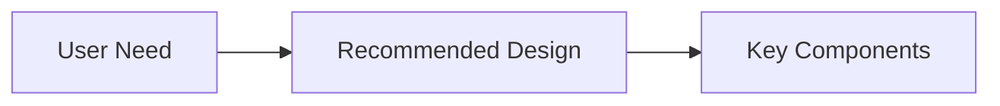

# Template: Brainstorming Readable Summary

Use this as a prefixed section for `brainstorming` design/spec documents.

## Placement

Insert before the original spec body.
Do not rewrite the spec body to fit this template.

## Required Sections

- `Readable Summary`
- `Recommended Approach`
- `Visual Overview`
- `Key Risks`

## Skeleton

````md
## Readable Summary
- Short explanation of what is being designed and why.

## Recommended Approach
- The preferred path in 2-4 sentences.

## Visual Overview


## Key Risks
- Main design risk
- Main open question
````
