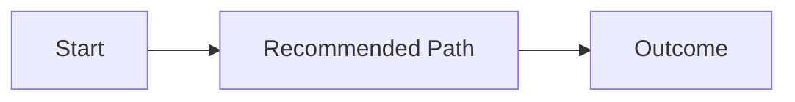

# Template: Chat Reader Summary

Use this template for complex planning, proposal, or system-design answers in chat.

## Order

1. `Goal`
2. `Phases`
3. `Visuals`
4. `Risks And Decisions`
5. `Recommendation`

## Rules

- Keep the overlay to 5 top-level sections or fewer.
- Recommendation must appear before long implementation detail.
- After the summary layer, preserve any deeper workflow-specific explanation that is still needed.

## Skeleton

````md
## Goal
- One-sentence outcome.

## Phases
- Phase 1: what, why now, done criteria
- Phase 2: what, why now, done criteria

## Visuals


## Risks And Decisions
- Main risk
- Key decision

## Recommendation
- Recommended path and why it wins
````
