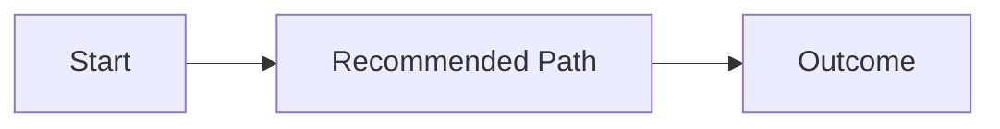

# Template: Chat Reader Summary

Use this template for complex planning, proposal, or system-design answers in chat.

## Order

1. `Conclusion`
2. `Recommendation`
3. `Key Changes`
4. `Visuals`
5. `Risks And Decisions`

## Rules

- Keep the overlay to 5 top-level sections or fewer.
- Recommendation must appear before long implementation detail.
- After the summary layer, preserve any deeper workflow-specific explanation that is still needed.

## Skeleton

````md
## Conclusion
- One-sentence outcome.

## Recommendation
- Recommended path and why it wins.

## Key Changes
- Change 1: what matters
- Change 2: why it matters

## Visuals


## Risks And Decisions
- Main risk
- Key decision
````
