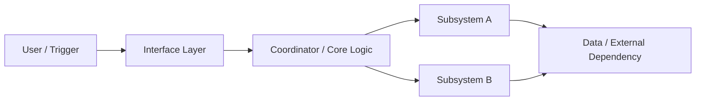

# Visual Template: Architecture

Use for system design, implementation shape, service boundaries, and component relationships.

## When To Use

- Architecture proposals
- System changes
- Integration design
- Component boundary explanations

## Template

## Rules

- Keep the first architecture diagram at boundary level.
- Use separate nodes for entrypoint, orchestration, key subsystems, and external dependencies.
- Avoid showing file names or class names in the first diagram unless they are the public interface.
- If the system has multiple planes, split them into separate diagrams instead of crowding one.

## Text Pairing

After the diagram, explain only:

- what each major block is responsible for
- why the chosen split is preferred
- where the main coupling or risk remains
