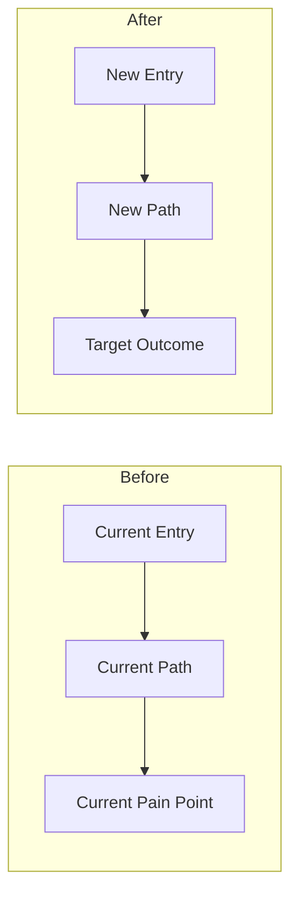

# Visual Template: Before / After

Use for refactors, migrations, ownership changes, and experience redesigns.

## When To Use

- Current-state vs target-state explanations
- Migration plans
- Simplification proposals
- Workflow redesign

## Template

## Rules

- The `Before` side should highlight the real pain or bottleneck.
- The `After` side should show the simpler or safer target state.
- Do not add more than one pain point in the first version.

## Text Pairing

After the diagram, explain only:

- what changes materially
- what improves for the reader or system
- what migration risk remains
