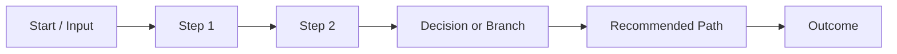

# Visual Template: Flowchart

Use for process, workflow, phase plans, rollout order, or dependency sequencing.

## When To Use

- Plan presentation
- Delivery workflow
- Incident / debugging process
- Review or approval flow

## Template

## Rules

- Show the main path only in the first diagram.
- Branches should be limited to meaningful alternatives.
- Prefer 4 to 7 nodes.
- Keep labels outcome-oriented, not implementation-oriented.

## Text Pairing

After the diagram, explain only:

- what the main path is
- why that path is recommended
- where the main risk sits
