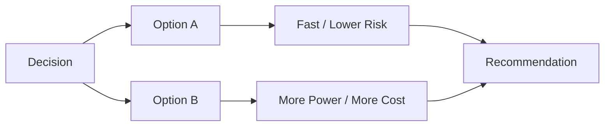

# Visual Template: Option Comparison

Use when there are multiple viable paths and the user needs a recommendation.

## When To Use

- Architecture tradeoffs
- Tooling choices
- Build vs buy
- Incremental vs full rewrite

## Template

## Rules

- Compare only real options.
- Use short labels that highlight the actual tradeoff.
- Recommendation should be obvious from the visual and confirmed in text.

## Text Pairing

After the diagram, explain only:

- outcome difference
- complexity difference
- risk difference
- why the recommendation wins
