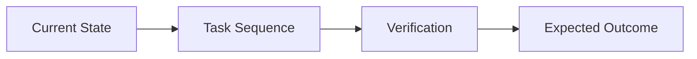
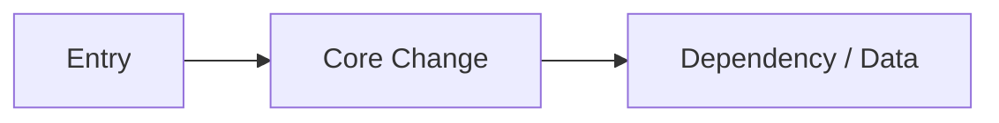

# Template: Writing-Plans Readable Summary

Use this as an additive section in a `writing-plans` plan document.

## Placement

Insert after the required `superpowers` plan header and before the first task or chunk.

## Required Sections

- `Reader Summary`
- `What This Changes`
- `Execution Flow`
- `Architecture Snapshot` when applicable
- `Main Risks`
- `Execution Recommendation`

## Skeleton

````md
## Reader Summary
- Short description of the change in user-facing terms.

## What This Changes
- The highest-signal changes only.

## Execution Flow


## Architecture Snapshot


## Main Risks
- Main implementation risk
- Main verification risk

## Execution Recommendation
- The recommended implementation path before the detailed tasks begin.
````
